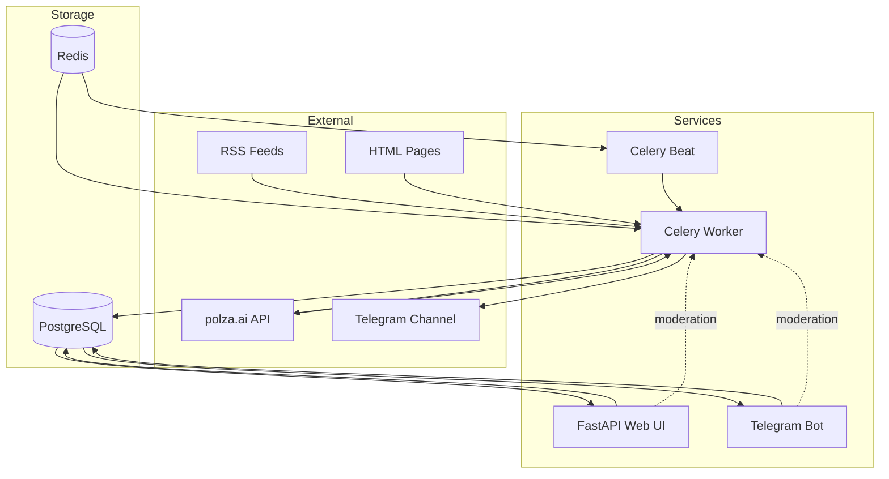
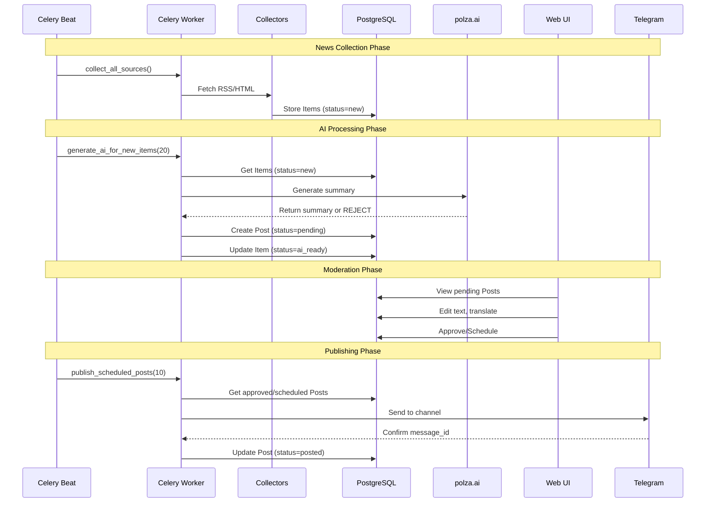
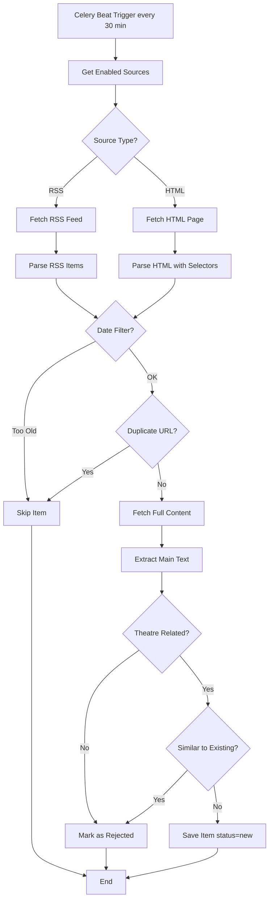
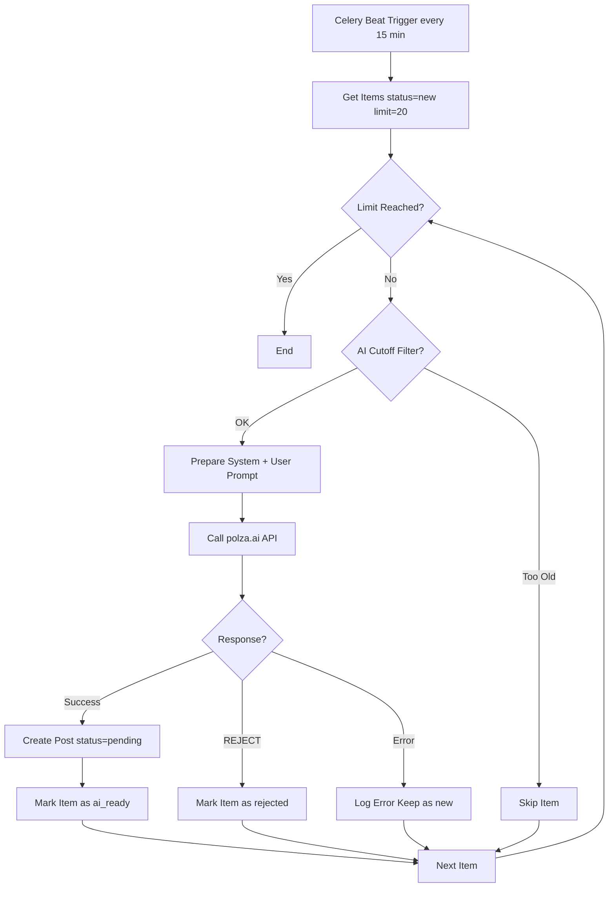
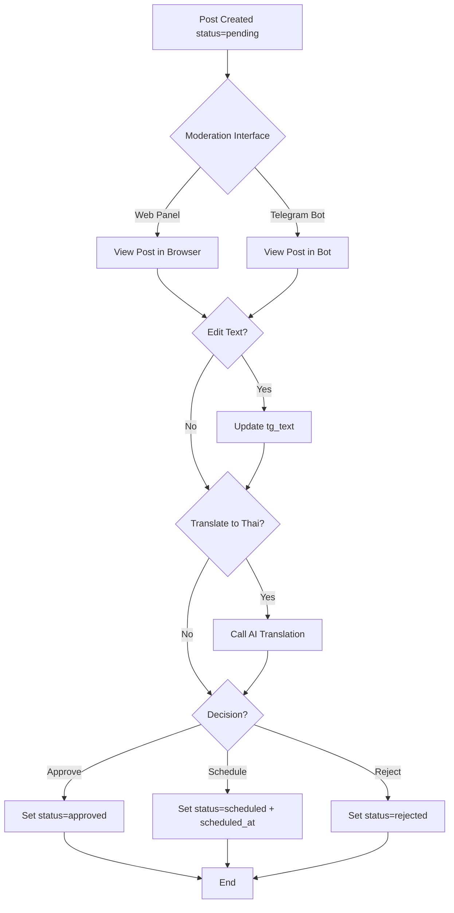
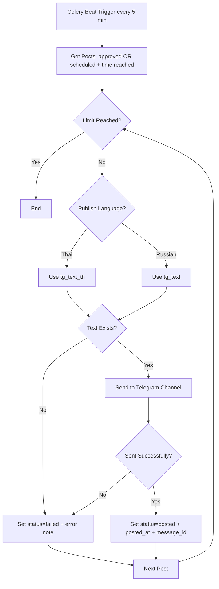

# AGENTS.md - Memory Bank

> **Bakhrushin Museum News Automation System**  
> Automated theatre news collection, AI processing, and Telegram publishing

---

## Table of Contents

1. [Project Overview](#project-overview)
2. [System Architecture](#system-architecture)
3. [Core Components](#core-components)
4. [Data Models](#data-models)
5. [Configuration](#configuration)
6. [Workflows](#workflows)
7. [API Endpoints](#api-endpoints)
8. [AI Integration](#ai-integration)
9. [Deployment](#deployment)
10. [Code Examples](#code-examples)
11. [Troubleshooting](#troubleshooting)
12. [Development Guidelines](#development-guidelines)
13. [Performance](#performance)
14. [Security](#security)
15. [Monitoring](#monitoring)
16. [Future Enhancements](#future-enhancements)

---

## Project Overview

### Description

**Bakhrushin Museum News** — автоматизированная система для сбора новостей о театральном искусстве из интернета, их обработки с помощью AI (OpenAI-compatible провайдер **polza.ai**), модерации и публикации в Telegram-канал **@bakhrushinmuseum_news**.

### Key Features

- ✅ Сбор новостей из **RSS** и **HTML** источников
- ✅ Хранение данных в **PostgreSQL** с миграциями Alembic
- ✅ Генерация кратких постов через **polza.ai** (OpenAI-compatible)
- ✅ Веб-панель модерации (**FastAPI + Jinja2**)
- ✅ Публикация в Telegram через **aiogram**
- ✅ Фоновые задачи через **Celery + Redis + Celery Beat**
- ✅ Перевод на тайский язык
- ✅ Планирование публикаций
- ✅ Telegram-бот для модерации

### Technology Stack

| Category | Technologies |
|----------|-------------|
| **Backend** | Python 3.11+, FastAPI, SQLAlchemy 2.0, Alembic |
| **Database** | PostgreSQL 16 |
| **Queue/Cache** | Redis 7, Celery |
| **AI** | polza.ai (OpenAI-compatible API) |
| **Telegram** | aiogram 3.x |
| **Web Parsing** | BeautifulSoup4, feedparser, httpx |
| **Deployment** | Docker, Docker Compose |
| **Templates** | Jinja2 |

### Pipeline

```
Sources (RSS/HTML) → Items → AI Processing → Posts (pending) → Moderation → Telegram Channel
```

### Project Structure

```
bakhrushin_tg/
├── app/
│   ├── ai/              # AI integration (polza.ai)
│   │   ├── client.py    # OpenAI-compatible client
│   │   ├── prompts.py   # System and user prompts
│   │   ├── summarize.py # Post generation
│   │   └── translate.py # RU→TH translation
│   ├── api/             # Web interface
│   │   └── routes.py    # FastAPI routes
│   ├── collectors/      # News collection
│   │   ├── rss.py       # RSS feed parser
│   │   └── html.py      # HTML page parser
│   ├── db/              # Database layer
│   │   ├── models.py    # SQLAlchemy models
│   │   └── session.py   # DB session management
│   ├── parsers/         # Text extraction
│   │   └── extract.py   # Main text extraction
│   ├── scripts/         # Utility scripts
│   │   └── seed_sources.py # Initial sources
│   ├── templates/       # Jinja2 templates
│   │   ├── base.html
│   │   ├── index.html
│   │   ├── post.html
│   │   ├── source_edit.html
│   │   └── sources.html
│   ├── tg/              # Telegram integration
│   │   ├── bot.py       # Moderation bot
│   │   └── sender.py    # Channel publisher
│   ├── utils/           # Utilities
│   │   └── text.py      # Text processing
│   ├── workers/         # Background jobs
│   │   ├── celery_app.py # Celery configuration
│   │   └── tasks.py     # Celery tasks
│   ├── config.py        # Settings (Pydantic)
│   └── main.py          # FastAPI app
├── migrations/          # Alembic migrations
│   └── versions/
├── docker-compose.yml   # Docker services
├── Dockerfile           # Python app image
├── requirements.txt     # Python dependencies
├── alembic.ini          # Alembic config
├── .env.example         # Environment template
└── README.md            # User documentation
```

---

## System Architecture

### High-Level Architecture



### Component Diagram

```mermaid
graph TB
    subgraph API Service
        FastAPI[FastAPI App]
        Routes[API Routes]
        Templates[Jinja2 Templates]
        FastAPI --> Routes
        Routes --> Templates
    end
    
    subgraph Workers
        CeleryWorker[Celery Worker]
        CeleryBeat[Celery Beat Scheduler]
        Tasks[Task Definitions]
        CeleryBeat --> CeleryWorker
        CeleryWorker --> Tasks
    end
    
    subgraph Collectors
        RSSCollector[RSS Collector]
        HTMLCollector[HTML Collector]
        Parser[Text Parser]
        RSSCollector --> Parser
        HTMLCollector --> Parser
    end
    
    subgraph AI Layer
        AIClient[polza.ai Client]
        Prompts[Prompt Templates]
        Summarizer[Summarizer]
        Translator[Translator]
        AIClient --> Summarizer
        AIClient --> Translator
        Prompts --> Summarizer
    end
    
    subgraph Data Layer
        Models[SQLAlchemy Models]
        Session[DB Session]
        Migrations[Alembic Migrations]
        Models --> Session
    end
    
    subgraph Telegram
        Bot[aiogram Bot]
        Sender[Channel Sender]
    end
    
    Tasks --> Collectors
    Tasks --> AI Layer
    Tasks --> Telegram
    Routes --> Data Layer
    Tasks --> Data Layer
    Bot --> Data Layer
```

### Data Flow Sequence



---

## Core Components

### 1. Collectors (`app/collectors/`)

#### RSS Collector ([`rss.py`](app/collectors/rss.py))

**Purpose**: Парсинг RSS-лент новостных сайтов

**Key Functions**:
- `fetch_rss(url: str, config: dict) -> list[dict]`

**Features**:
- Использует `feedparser` для парсинга RSS/Atom
- Извлекает: title, link, published_at, description
- Поддержка различных форматов дат
- Фильтрация по дате (NEWS_NOT_BEFORE_DAYS)

**Example Config**:
```json
{
  "type": "rss"
}
```

#### HTML Collector ([`html.py`](app/collectors/html.py))

**Purpose**: Парсинг HTML-страниц с новостями

**Key Functions**:
- `fetch_html_entries(url: str, config: dict) -> list[dict]`

**Features**:
- Использует `BeautifulSoup4` для парсинга HTML
- Конфигурируемые CSS-селекторы
- Извлечение списка новостей со страницы
- Поддержка различных форматов дат

**Example Config**:
```json
{
  "type": "html",
  "list_selector": "article.news-item",
  "link_selector": "a.title",
  "title_selector": "h2.title",
  "date_selector": "time",
  "date_format": "%Y-%m-%d"
}
```

**CSS Selectors**:
- `list_selector` - контейнер для каждой новости
- `link_selector` - ссылка на полную новость
- `title_selector` - заголовок новости
- `date_selector` - дата публикации
- `date_format` - формат даты (strptime)

### 2. Parsers (`app/parsers/`)

#### Text Extractor ([`extract.py`](app/parsers/extract.py))

**Purpose**: Извлечение основного текста из HTML-страницы

**Key Functions**:
- `extract_main_text(html: str) -> str`

**Features**:
- Удаление скриптов, стилей, навигации
- Извлечение текста из параграфов
- Очистка от лишних пробелов
- Нормализация текста

**Algorithm**:
1. Парсинг HTML с BeautifulSoup
2. Удаление тегов: script, style, nav, header, footer
3. Поиск основного контента (article, main, div.content)
4. Извлечение текста из параграфов
5. Нормализация пробелов и переносов строк

### 3. AI Integration (`app/ai/`)

#### Client ([`client.py`](app/ai/client.py))

**Purpose**: OpenAI-compatible клиент для polza.ai

**Key Functions**:
- `get_client() -> OpenAI`

**Configuration**:
- Base URL: `settings.polza_base_url`
- API Key: `settings.polza_api_key`
- Model: `settings.ai_model`
- Temperature: `settings.ai_temperature`

#### Prompts ([`prompts.py`](app/ai/prompts.py))

**System Prompt**:
```
Ты редактор официального Telegram-канала Государственного центрального 
театрального музея имени А. А. Бахрушина.
Твоя задача — писать краткие, аккуратные, культурные посты о новостях 
театрального искусства.

Ограничения и правила:
- НЕ копируй текст первоисточника дословно. Только пересказ.
- 600–1200 знаков (обычно).
- Без кликбейта, без политических оценок.
- В конце обязательно укажи: «Источник: <URL>».
- Добавь 2–5 хэштегов по теме (на русском), например: #театр #премьера #фестиваль.
- Если новость не относится к театру/сценическому искусству — верни строго: REJECT
```

**User Prompt Template**:
```python
def user_prompt(title: str, text: str, url: str) -> str:
    return f"""Заголовок: {title}

Текст новости (извлечённый):
{text}

Ссылка: {url}

Сделай итоговый пост по правилам."""
```

#### Summarizer ([`summarize.py`](app/ai/summarize.py))

**Purpose**: Генерация кратких постов для Telegram

**Key Functions**:
- `generate_post(title: str, text: str, url: str) -> str | None`

**Features**:
- Вызов polza.ai API с system и user prompts
- Обработка ответа "REJECT" для нерелевантных новостей
- Обработка ошибок API
- Возврат готового текста поста

**Return Values**:
- `str` - готовый пост для публикации
- `None` - если AI вернул REJECT или произошла ошибка

#### Translator ([`translate.py`](app/ai/translate.py))

**Purpose**: Перевод постов с русского на тайский

**Key Functions**:
- `translate_ru_to_th(text: str, style: str = "neutral") -> str`

**Translation Styles**:
- `formal` - официальный стиль для деловых новостей
- `neutral` - нейтральный стиль (по умолчанию)
- `social` - социальный стиль для неформальных новостей

**Features**:
- Сохранение форматирования (переносы строк, ссылки)
- Сохранение хэштегов
- Адаптация стиля под аудиторию

### 4. Web Interface (`app/api/`)

#### Routes ([`routes.py`](app/api/routes.py))

**Purpose**: FastAPI маршруты для веб-панели модерации

**Key Routes**:

| Method | Path | Description |
|--------|------|-------------|
| GET | `/` | Список постов на модерации |
| GET | `/posts/{id}` | Просмотр и редактирование поста |
| POST | `/posts/{id}/update` | Обновление текста поста |
| POST | `/posts/{id}/translate_th` | Перевод на тайский |
| POST | `/posts/{id}/approve` | Одобрение поста (публикация ASAP) |
| POST | `/posts/{id}/schedule` | Планирование публикации |
| POST | `/posts/{id}/reject` | Отклонение поста |
| GET | `/sources` | Список источников |
| GET | `/sources/{id}/edit` | Редактирование источника |
| POST | `/sources/{id}/update` | Обновление источника |
| POST | `/sources/{id}/test` | Тестирование источника |
| POST | `/sources/{id}/delete` | Удаление источника |
| POST | `/sources/create` | Создание нового источника |

**Features**:
- Jinja2 templates для UI
- Поддержка MSK timezone для scheduled_at
- Inline редактирование текста
- Статистика по статусам постов
- Управление источниками (CRUD)
- Тестирование доступности источников

#### Templates ([`app/templates/`](app/templates/))

**Template Files**:
- [`base.html`](app/templates/base.html) - базовый шаблон с навигацией
- [`index.html`](app/templates/index.html) - список постов
- [`post.html`](app/templates/post.html) - просмотр/редактирование поста
- [`sources.html`](app/templates/sources.html) - список источников
- [`source_edit.html`](app/templates/source_edit.html) - редактирование источника

**UI Features**:
- Bootstrap 5 для стилизации
- Inline редактирование textarea
- Кнопки действий (Approve, Schedule, Reject)
- Отображение метаданных (source, published_at, created_at)
- JSON editor для parser_config
- Health status для источников

### 5. Telegram Integration (`app/tg/`)

#### Bot ([`bot.py`](app/tg/bot.py))

**Purpose**: Telegram-бот для модерации постов

**Commands**:
- `/start` - приветствие и список команд
- `/help` - справка по командам
- `/queue` - показать первые 10 постов на модерации

**Callback Handlers**:
- `approve:{post_id}` - одобрить пост
- `schedule1h:{post_id}` - запланировать через 1 час
- `reject:{post_id}` - отклонить пост
- `edit:{post_id}` - редактировать (reply с новым текстом)

**Features**:
- Inline-кнопки для быстрой модерации
- Редактирование через reply на сообщение
- Проверка прав доступа (TELEGRAM_ADMIN_IDS)
- Отображение метаданных поста
- Подтверждение действий

**Access Control**:
```python
def is_admin(user_id: int) -> bool:
    admins = settings.telegram_admin_id_set
    return (not admins) or (user_id in admins)
```

#### Sender ([`sender.py`](app/tg/sender.py))

**Purpose**: Публикация постов в Telegram-канал

**Key Functions**:
- `send_to_channel(text: str, channel: str) -> str`

**Features**:
- Отправка текста в канал
- Поддержка HTML форматирования
- Возврат message_id для отслеживания
- Обработка ошибок Telegram API

**Return Values**:
- `str` - message_id опубликованного сообщения
- Raises exception при ошибке

### 6. Background Jobs (`app/workers/`)

#### Celery App ([`celery_app.py`](app/workers/celery_app.py))

**Purpose**: Конфигурация Celery для фоновых задач

**Configuration**:
```python
celery_app = Celery(
    "bakhrushin",
    broker=settings.celery_broker_url,
    backend=settings.celery_result_backend
)
```

**Beat Schedule**:
```python
celery_app.conf.beat_schedule = {
    "collect-sources": {
        "task": "app.workers.tasks.collect_all_sources",
        "schedule": crontab(minute="*/30")  # Every 30 minutes
    },
    "generate-ai": {
        "task": "app.workers.tasks.generate_ai_for_new_items",
        "schedule": crontab(minute="*/15")  # Every 15 minutes
    },
    "publish-posts": {
        "task": "app.workers.tasks.publish_scheduled_posts",
        "schedule": crontab(minute="*/5")  # Every 5 minutes
    },
    "health-check": {
        "task": "app.workers.tasks.health_check_sources",
        "schedule": crontab(hour="*/6")  # Every 6 hours
    }
}
```

#### Tasks ([`tasks.py`](app/workers/tasks.py))

**Key Tasks**:

1. **`collect_all_sources()`**
   - Собирает новости из всех активных источников
   - Фильтрует по дате (NEWS_NOT_BEFORE_DAYS)
   - Проверяет дубликаты по URL
   - Извлекает полный текст
   - Проверяет релевантность (theatre keywords)
   - Проверяет схожесть с существующими (fuzzy matching)
   - Сохраняет Items со статусом `new`

2. **`generate_ai_for_new_items(limit: int = 20)`**
   - Обрабатывает Items со статусом `new`
   - Фильтрует по дате (AI_NOT_BEFORE_DAYS)
   - Генерирует посты через polza.ai
   - Создает Posts со статусом `pending`
   - Обновляет Items на статус `ai_ready` или `rejected`

3. **`publish_scheduled_posts(limit: int = 10)`**
   - Публикует Posts со статусом `approved` или `scheduled` (если время пришло)
   - Выбирает язык публикации (TG_PUBLISH_LANGUAGE)
   - Отправляет в Telegram-канал
   - Обновляет статус на `posted` или `failed`
   - Сохраняет message_id и posted_at

4. **`health_check_sources()`**
   - Проверяет доступность всех источников
   - Сохраняет HTTP status code
   - Отслеживает fail_streak
   - Автоматически отключает источники при превышении порога (AUTO_DISABLE_ON_401_403)

**Theatre Keywords Filter**:
```python
THEATRE_KEYWORDS = [
    "театр", "премьера", "спектакль", "режисс", "актер", "актриса",
    "сцена", "фестиваль", "драма", "опера", "балет", "постановк",
    "гастрол", "репертуар", "труппа", "мюзикл", "капустник",
    "читк", "перформанс", "хореограф"
]

def is_theatre_related(text: str) -> bool:
    t = (text or "").lower()
    hits = sum(1 for k in THEATRE_KEYWORDS if k in t)
    return hits >= 2  # Minimum 2 keywords
```

**Similarity Check**:
```python
def similar_enough(a: str, b: str) -> bool:
    if not a or not b:
        return False
    return ratio(a[:1500], b[:1500]) >= 93  # 93% similarity threshold
```

---

## Data Models

### Database Schema

```mermaid
erDiagram
    Source ||--o{ Item : has
    Item ||--o| Post : generates
    
    Source {
        int id PK
        string name
        enum type "rss or html"
        text url
        boolean enabled
        jsonb parser_config
        int last_status_code
        datetime last_checked_at
        text last_error
        int fail_streak
        datetime created_at
    }
    
    Item {
        int id PK
        int source_id FK
        text url UK
        text title
        datetime published_at
        text raw_text
        text raw_html
        string hash_text
        string lang
        enum status "new, ai_ready, rejected"
        datetime created_at
    }
    
    Post {
        int id PK
        int item_id FK UK
        text tg_text
        text tg_text_th
        jsonb tg_media
        string style_version
        enum moderation_status "pending, approved, rejected, scheduled, posted, failed"
        datetime scheduled_at
        datetime posted_at
        string tg_message_id
        text editor_notes
        datetime created_at
    }
```

### Model Definitions

#### Source ([`models.py`](app/db/models.py))

```python
class SourceType(str, enum.Enum):
    rss = "rss"
    html = "html"

class Source(Base):
    __tablename__ = "sources"
    
    id: int                          # Primary key
    name: str                        # Display name
    type: SourceType                 # rss or html
    url: str                         # Source URL
    enabled: bool                    # Active/inactive
    parser_config: dict              # JSON config for parser
    
    # Health monitoring
    last_status_code: int | None     # HTTP status from last check
    last_checked_at: datetime | None # Last health check time
    last_error: str | None           # Error message if failed
    fail_streak: int                 # Consecutive failures
    
    created_at: datetime             # Creation timestamp
    
    # Relationships
    items: list[Item]                # Related items
```

#### Item ([`models.py`](app/db/models.py))

```python
class ItemStatus(str, enum.Enum):
    new = "new"           # Collected, waiting for AI
    ai_ready = "ai_ready" # AI processed successfully
    rejected = "rejected" # Rejected by filters or AI

class Item(Base):
    __tablename__ = "items"
    
    id: int                          # Primary key
    source_id: int                   # Foreign key to Source
    url: str                         # Unique URL
    title: str | None                # Article title
    published_at: datetime | None    # Publication date
    
    # Content
    raw_text: str | None             # Extracted text
    raw_html: str | None             # Original HTML
    
    # Metadata
    hash_text: str | None            # Text hash for deduplication
    lang: str | None                 # Detected language
    status: ItemStatus               # Processing status
    
    created_at: datetime             # Creation timestamp
    
    # Relationships
    source: Source                   # Related source
    post: Post | None                # Related post (if generated)
```

#### Post ([`models.py`](app/db/models.py))

```python
class ModerationStatus(str, enum.Enum):
    pending = "pending"       # Waiting for moderation
    approved = "approved"     # Approved, publish ASAP
    rejected = "rejected"     # Rejected by moderator
    scheduled = "scheduled"   # Scheduled for future
    posted = "posted"         # Successfully published
    failed = "failed"         # Publishing failed

class Post(Base):
    __tablename__ = "posts"
    
    id: int                          # Primary key
    item_id: int                     # Foreign key to Item (unique)
    
    # Content
    tg_text: str | None              # Russian text
    tg_text_th: str | None           # Thai text
    tg_media: dict                   # Media attachments (JSON)
    
    # Metadata
    style_version: str               # Prompt version used
    moderation_status: ModerationStatus
    scheduled_at: datetime | None    # Scheduled publication time
    posted_at: datetime | None       # Actual publication time
    tg_message_id: str | None        # Telegram message ID
    editor_notes: str | None         # Moderator notes
    
    created_at: datetime             # Creation timestamp
    
    # Relationships
    item: Item                       # Related item
```

### Database Indexes

```sql
-- Unique constraints
CREATE UNIQUE INDEX uq_items_url ON items(url);
CREATE UNIQUE INDEX uq_posts_item_id ON posts(item_id);

-- Performance indexes
CREATE INDEX idx_items_hash_text ON items(hash_text);
CREATE INDEX idx_items_status ON items(status);
CREATE INDEX idx_posts_moderation_status ON posts(moderation_status);
CREATE INDEX idx_posts_scheduled_at ON posts(scheduled_at);
CREATE INDEX idx_sources_enabled ON sources(enabled);
```

---

## Configuration

### Environment Variables

```bash
# Database
DATABASE_URL=postgresql://user:pass@db:5432/bakhrushin

# Redis/Celery
REDIS_URL=redis://redis:6379/0
CELERY_BROKER_URL=redis://redis:6379/0
CELERY_RESULT_BACKEND=redis://redis:6379/0

# Telegram
TELEGRAM_BOT_TOKEN=1234567890:ABCdefGHIjklMNOpqrsTUVwxyz
TELEGRAM_CHANNEL=@bakhrushinmuseum_news
TELEGRAM_ADMIN_IDS=123456789,987654321  # Comma-separated

# AI (polza.ai)
POLZA_API_KEY=your_api_key_here
POLZA_BASE_URL=https://api.polza.ai/api/v1
AI_MODEL=openai/gpt-4o-mini
AI_TEMPERATURE=0.4
TG_TRANSLATION_MODEL=openai/gpt-4o-mini
TG_TRANSLATION_STYLE=neutral  # formal|neutral|social
TG_PUBLISH_LANGUAGE=th        # th|ru

# Cutoffs (sliding window)
NEWS_NOT_BEFORE_DAYS=7        # Skip items older than N days
AI_NOT_BEFORE_DAYS=7          # Skip AI processing for items older than N days

# App
APP_ENV=prod
APP_BASE_URL=http://localhost:8000
SECRET_KEY=change_me_in_production

# Auto-disable sources on errors
AUTO_DISABLE_ON_401_403=false
AUTO_DISABLE_THRESHOLD=3      # Disable after N consecutive failures
```

### Parser Configuration Examples

#### RSS Source

```json
{
  "type": "rss"
}
```

#### HTML Source (Basic)

```json
{
  "type": "html",
  "list_selector": "article.news-item",
  "link_selector": "a.title",
  "title_selector": "h2.title"
}
```

#### HTML Source (With Date)

```json
{
  "type": "html",
  "list_selector": "div.news-list > div.item",
  "link_selector": "a.link",
  "title_selector": "h3.headline",
  "date_selector": "time.published",
  "date_format": "%Y-%m-%d"
}
```

#### HTML Source (Complex)

```json
{
  "type": "html",
  "list_selector": "section.news article",
  "link_selector": "a[href*='/news/']",
  "title_selector": "h2.title, h3.title",
  "date_selector": "span.date",
  "date_format": "%d.%m.%Y"
}
```

### Date Format Codes

| Code | Meaning | Example |
|------|---------|---------|
| `%Y` | Year (4 digits) | 2024 |
| `%y` | Year (2 digits) | 24 |
| `%m` | Month (01-12) | 03 |
| `%d` | Day (01-31) | 15 |
| `%H` | Hour (00-23) | 14 |
| `%M` | Minute (00-59) | 30 |
| `%S` | Second (00-59) | 45 |

---

## Workflows

### News Collection Workflow



### AI Processing Workflow



### Moderation Workflow



### Publishing Workflow



---

## API Endpoints

### Web UI Routes

| Method | Path | Description | Parameters |
|--------|------|-------------|------------|
| GET | `/` | Список постов на модерации | - |
| GET | `/posts/{id}` | Просмотр поста | `id: int` |
| POST | `/posts/{id}/update` | Обновление текста | `tg_text: str, tg_text_th: str` |
| POST | `/posts/{id}/translate_th` | Перевод на тайский | - |
| POST | `/posts/{id}/approve` | Одобрение (публикация ASAP) | - |
| POST | `/posts/{id}/schedule` | Планирование | `scheduled_at: str (MSK)` |
| POST | `/posts/{id}/reject` | Отклонение | - |
| GET | `/sources` | Список источников | - |
| GET | `/sources/{id}/edit` | Редактирование источника | `id: int` |
| POST | `/sources/{id}/update` | Обновление источника | `name, type, url, enabled, parser_config` |
| POST | `/sources/{id}/test` | Тестирование источника | - |
| POST | `/sources/{id}/delete` | Удаление источника | - |
| POST | `/sources/create` | Создание источника | `name, type, url, parser_config` |

### Telegram Bot Commands

| Command | Description | Access |
|---------|-------------|--------|
| `/start` | Приветствие и список команд | Admin only |
| `/help` | Справка по командам | Admin only |
| `/queue` | Показать первые 10 постов на модерации | Admin only |

### Telegram Bot Callbacks

| Callback | Description | Action |
|----------|-------------|--------|
| `approve:{post_id}` | Одобрить пост | Set status=approved |
| `schedule1h:{post_id}` | Запланировать через 1 час | Set status=scheduled, scheduled_at=now+1h |
| `reject:{post_id}` | Отклонить пост | Set status=rejected |
| `edit:{post_id}` | Редактировать | Wait for reply with new text |

---

## AI Integration

### polza.ai Configuration

**API Details**:
- **Provider**: polza.ai (OpenAI-compatible)
- **Base URL**: `https://api.polza.ai/api/v1`
- **Authentication**: Bearer token (POLZA_API_KEY)
- **Model**: `openai/gpt-4o-mini` (configurable)
- **Temperature**: 0.4 (balance creativity/consistency)

**Client Setup** ([`client.py`](app/ai/client.py)):
```python
from openai import OpenAI
from app.config import settings

def get_client() -> OpenAI:
    return OpenAI(
        api_key=settings.polza_api_key,
        base_url=settings.polza_base_url
    )
```

### Prompt Engineering

#### System Prompt ([`prompts.py`](app/ai/prompts.py))

```
Ты редактор официального Telegram-канала Государственного центрального 
театрального музея имени А. А. Бахрушина.
Твоя задача — писать краткие, аккуратные, культурные посты о новостях 
театрального искусства.

Ограничения и правила:
- НЕ копируй текст первоисточника дословно. Только пересказ.
- 600–1200 знаков (обычно).
- Без кликбейта, без политических оценок.
- В конце обязательно укажи: «Источник: <URL>».
- Добавь 2–5 хэштегов по теме (на русском), например: #театр #премьера #фестиваль.
- Если новость не относится к театру/сценическому искусству — верни строго: REJECT
```

**Key Requirements**:
- ✅ Paraphrase, not copy
- ✅ 600-1200 characters
- ✅ No clickbait or politics
- ✅ Include source URL
- ✅ Add 2-5 hashtags
- ✅ Return "REJECT" for non-theatre news

#### User Prompt Template

```python
def user_prompt(title: str, text: str, url: str) -> str:
    return f"""Заголовок: {title}

Текст новости (извлечённый):
{text}

Ссылка: {url}

Сделай итоговый пост по правилам."""
```

### Translation

**Translation Styles** ([`translate.py`](app/ai/translate.py)):

| Style | Description | Use Case |
|-------|-------------|----------|
| `formal` | Официальный стиль | Деловые новости, официальные анонсы |
| `neutral` | Нейтральный стиль (default) | Обычные новости |
| `social` | Социальный стиль | Неформальные новости, события |

**Translation Prompt**:
```python
system_prompt = f"""You are a professional translator from Russian to Thai.
Translate the following Telegram post preserving:
- Line breaks
- Links
- Hashtags (keep in Russian)
- Formatting

Style: {style}
"""
```

### Theatre Keywords Filter

**Keywords** ([`tasks.py`](app/workers/tasks.py)):
```python
THEATRE_KEYWORDS = [
    "театр", "премьера", "спектакль", "режисс", "актер", "актриса",
    "сцена", "фестиваль", "драма", "опера", "балет", "постановк",
    "гастрол", "репертуар", "труппа", "мюзикл", "капустник",
    "читк", "перформанс", "хореограф"
]
```

**Filter Logic**:
```python
def is_theatre_related(text: str) -> bool:
    t = (text or "").lower()
    if not t:
        return False
    hits = sum(1 for k in THEATRE_KEYWORDS if k in t)
    return hits >= 2  # Minimum 2 keywords required
```

**Rationale**: Требуется минимум 2 совпадения для снижения false positives.

### Similarity Detection

**Algorithm** ([`tasks.py`](app/workers/tasks.py)):
```python
from rapidfuzz.fuzz import ratio

def similar_enough(a: str, b: str) -> bool:
    if not a or not b:
        return False
    # Compare first 1500 characters
    return ratio(a[:1500], b[:1500]) >= 93  # 93% similarity threshold
```

**Purpose**: Предотвращение дубликатов новостей с разными URL.

---

## Deployment

### Docker Services

**Services** ([`docker-compose.yml`](docker-compose.yml)):

```yaml
services:
  db:           # PostgreSQL 16
  redis:        # Redis 7
  api:          # FastAPI + Uvicorn
  celery_worker: # Background tasks
  celery_beat:  # Scheduler
  tg_bot:       # Telegram bot
```

**Service Details**:

| Service | Image | Port | Command |
|---------|-------|------|---------|
| `db` | postgres:16 | 15432:5432 | Default |
| `redis` | redis:7 | - | Default |
| `api` | Custom (Dockerfile) | 8000:8000 | `uvicorn app.main:app --host 0.0.0.0 --port 8000` |
| `celery_worker` | Custom (Dockerfile) | - | `celery -A app.workers.celery_app worker -l INFO` |
| `celery_beat` | Custom (Dockerfile) | - | `celery -A app.workers.celery_app beat -l INFO` |
| `tg_bot` | Custom (Dockerfile) | - | `python -m app.tg.bot` |

### Deployment Steps

#### 1. Clone Repository

```bash
git clone <repository-url>
cd bakhrushin_tg
```

#### 2. Configure Environment

```bash
cp .env.example .env
nano .env  # Edit configuration
```

**Required Variables**:
- `TELEGRAM_BOT_TOKEN` - from @BotFather
- `TELEGRAM_CHANNEL` - channel username (e.g., @bakhrushinmuseum_news)
- `POLZA_API_KEY` - from polza.ai

#### 3. Build and Start Services

```bash
docker compose up -d --build
```

#### 4. Initialize Database

```bash
# Run migrations
docker compose exec api alembic upgrade head

# Seed initial sources
docker compose exec api python -m app.scripts.seed_sources
```

#### 5. Verify Services

```bash
# Check service status
docker compose ps

# Check logs
docker compose logs -f api
docker compose logs -f celery_worker
```

#### 6. Access Web Panel

Open browser: http://localhost:8000

- Posts moderation: http://localhost:8000/
- Sources management: http://localhost:8000/sources

### Telegram Setup

#### 1. Create Bot

1. Open Telegram, find @BotFather
2. Send `/newbot`
3. Follow instructions
4. Copy bot token to `.env` as `TELEGRAM_BOT_TOKEN`

#### 2. Create Channel

1. Create public channel (e.g., @bakhrushinmuseum_news)
2. Add bot as admin with posting rights
3. Set channel username in `.env` as `TELEGRAM_CHANNEL`

#### 3. Configure Admin Access (Optional)

1. Get your Telegram user ID (use @userinfobot)
2. Add to `.env` as `TELEGRAM_ADMIN_IDS=123456789,987654321`

### Health Checks

**Database Connectivity**:
```bash
docker compose exec db psql -U "$POSTGRES_USER" -d "$POSTGRES_DB" -c "SELECT 1"
```

**Redis Connectivity**:
```bash
docker compose exec redis redis-cli ping
```

**Celery Worker Status**:
```bash
docker compose exec celery_worker celery -A app.workers.celery_app inspect active
```

**Source Health**:
- Navigate to http://localhost:8000/sources
- Click "Test" button for each source
- Check `last_status_code` and `last_error`

---

## Code Examples

### Adding a New RSS Source

```python
from app.db.session import SessionLocal
from app.db.models import Source, SourceType

with SessionLocal() as db:
    source = Source(
        name="Theatre News Portal",
        type=SourceType.rss,
        url="https://example.com/theatre/rss",
        enabled=True,
        parser_config={"type": "rss"}
    )
    db.add(source)
    db.commit()
    print(f"Created source #{source.id}")
```

### Adding a New HTML Source

```python
source = Source(
    name="Theatre Magazine",
    type=SourceType.html,
    url="https://example.com/news",
    enabled=True,
    parser_config={
        "type": "html",
        "list_selector": "article.news-item",
        "link_selector": "a.title",
        "title_selector": "h2",
        "date_selector": "time",
        "date_format": "%Y-%m-%d"
    }
)
db.add(source)
db.commit()
```

### Manual Task Execution

```bash
# Collect sources
docker compose exec api python -c "
from app.workers.tasks import collect_all_sources
collect_all_sources()
"

# Generate AI posts (limit 20)
docker compose exec api python -c "
from app.workers.tasks import generate_ai_for_new_items
generate_ai_for_new_items(20)
"

# Publish posts (limit 10)
docker compose exec api python -c "
from app.workers.tasks import publish_scheduled_posts
publish_scheduled_posts(10)
"

# Health check sources
docker compose exec api python -c "
from app.workers.tasks import health_check_sources
health_check_sources()
"
```

### Database Queries

#### Get Pending Posts

```python
from sqlalchemy import select
from app.db.session import SessionLocal
from app.db.models import Post, ModerationStatus

with SessionLocal() as db:
    posts = db.scalars(
        select(Post)
        .where(Post.moderation_status == ModerationStatus.pending)
        .order_by(Post.created_at.desc())
        .limit(10)
    ).all()
    
    for post in posts:
        print(f"Post #{post.id}: {post.item.title}")
```

#### Get Items Without Posts

```python
from app.db.models import Item, ItemStatus

with SessionLocal() as db:
    items = db.scalars(
        select(Item)
        .where(Item.status == ItemStatus.new)
        .where(~Item.post.has())  # No related post
        .limit(20)
    ).all()
```

#### Get Source Statistics

```python
from sqlalchemy import func
from app.db.models import Source, Item

with SessionLocal() as db:
    stats = db.execute(
        select(
            Source.name,
            func.count(Item.id).label("item_count")
        )
        .join(Item)
        .group_by(Source.id)
        .order_by(func.count(Item.id).desc())
    ).all()
    
    for name, count in stats:
        print(f"{name}: {count} items")
```

### Testing AI Generation

```python
from app.ai.summarize import generate_post

title = "Премьера спектакля в Большом театре"
text = """
Большой театр представил премьеру нового балета...
(полный текст новости)
"""
url = "https://example.com/news/123"

result = generate_post(title, text, url)

if result is None:
    print("AI rejected the news")
elif result == "REJECT":
    print("Not theatre-related")
else:
    print(f"Generated post:\n{result}")
```

### Testing Translation

```python
from app.ai.translate import translate_ru_to_th

ru_text = """
Большой театр представил премьеру нового балета.

Источник: https://example.com/news/123

#театр #балет #премьера
"""

th_text = translate_ru_to_th(ru_text, style="neutral")
print(f"Thai translation:\n{th_text}")
```

---

## Troubleshooting

### Common Issues

#### "Received unregistered task" in celery_worker

**Symptoms**:
```
[ERROR/MainProcess] Received unregistered task of type 'app.workers.tasks.collect_all_sources'
```

**Cause**: Worker не импортировал задачи из [`tasks.py`](app/workers/tasks.py)

**Solution**:
```bash
# Restart workers
docker compose restart celery_worker celery_beat

# Check logs
docker compose logs -f celery_worker
```

**Prevention**: Убедитесь, что [`celery_app.py`](app/workers/celery_app.py) импортирует задачи:
```python
from app.workers import tasks  # Import tasks module
```

#### Port 6379 already in use

**Symptoms**:
```
Error starting userland proxy: listen tcp4 0.0.0.0:6379: bind: address already in use
```

**Cause**: Локальный Redis уже использует порт 6379

**Solution 1**: Остановить локальный Redis
```bash
sudo systemctl stop redis
```

**Solution 2**: Убрать port mapping в [`docker-compose.yml`](docker-compose.yml)
```yaml
redis:
  image: redis:7
  # ports:
  #   - "6379:6379"  # Comment out
```

#### 401/403 errors from sources

**Symptoms**:
```
[ERROR] Source #5 failed: HTTP 403 Forbidden
```

**Cause**: Сайт блокирует ботов или требует авторизацию

**Solution**:
1. Проверить доступность в браузере
2. Попробовать другой URL (например, RSS вместо HTML)
3. Отключить источник: `enabled=False`
4. Использовать прокси (требует доработки)

**Auto-disable**: Включить автоматическое отключение
```bash
AUTO_DISABLE_ON_401_403=true
AUTO_DISABLE_THRESHOLD=3
```

#### AI returns REJECT for theatre news

**Symptoms**: Театральные новости отклоняются AI

**Cause**: 
- Недостаточно театральных ключевых слов в тексте
- Текст слишком короткий
- Неправильное извлечение текста

**Solution**:
1. Проверить извлеченный текст в БД:
```python
item = db.get(Item, item_id)
print(item.raw_text)
```

2. Проверить фильтр ключевых слов:
```python
from app.workers.tasks import is_theatre_related
print(is_theatre_related(item.raw_text))
```

3. Настроить `THEATRE_KEYWORDS` в [`tasks.py`](app/workers/tasks.py)

4. Снизить порог в `is_theatre_related()`:
```python
return hits >= 1  # Instead of 2
```

#### Thai translation fails

**Symptoms**: `tg_text_th` остается пустым после перевода

**Cause**:
- Пустой `tg_text`
- Ошибка API polza.ai
- Неправильный API key

**Solution**:
1. Проверить `tg_text`:
```python
post = db.get(Post, post_id)
print(f"Russian text: {post.tg_text}")
```

2. Проверить API key:
```bash
echo $POLZA_API_KEY
```

3. Проверить логи:
```bash
docker compose logs -f api | grep -i translation
```

4. Тестировать вручную:
```python
from app.ai.translate import translate_ru_to_th
result = translate_ru_to_th("Тестовый текст", style="neutral")
print(result)
```

#### Database migration errors

**Symptoms**:
```
sqlalchemy.exc.ProgrammingError: relation "posts" does not exist
```

**Cause**: Миграции не применены

**Solution**:
```bash
# Check current revision
docker compose exec api alembic current

# Apply migrations
docker compose exec api alembic upgrade head

# If stuck, reset database (WARNING: data loss)
docker compose down -v
docker compose up -d
docker compose exec api alembic upgrade head
```

#### Celery Beat not triggering tasks

**Symptoms**: Задачи не выполняются по расписанию

**Cause**:
- Beat не запущен
- Неправильное расписание
- Timezone issues

**Solution**:
1. Проверить статус Beat:
```bash
docker compose ps celery_beat
docker compose logs -f celery_beat
```

2. Проверить расписание в [`celery_app.py`](app/workers/celery_app.py)

3. Перезапустить Beat:
```bash
docker compose restart celery_beat
```

4. Удалить schedule file:
```bash
rm celerybeat-schedule
docker compose restart celery_beat
```

### Logs

#### View All Logs

```bash
docker compose logs -f
```

#### View Specific Service Logs

```bash
# API / Web panel
docker compose logs -f api

# Background worker
docker compose logs -f celery_worker

# Scheduler
docker compose logs -f celery_beat

# Telegram bot
docker compose logs -f tg_bot

# Database
docker compose logs -f db

# Redis
docker compose logs -f redis
```

#### Filter Logs

```bash
# Errors only
docker compose logs -f | grep -i error

# Specific task
docker compose logs -f celery_worker | grep collect_all_sources

# Last 100 lines
docker compose logs --tail=100 api
```

### Database Backup

#### Dump Database

```bash
# Full dump
docker compose exec db pg_dump -U "$POSTGRES_USER" "$POSTGRES_DB" > backup.sql

# Schema only
docker compose exec db pg_dump -U "$POSTGRES_USER" "$POSTGRES_DB" --schema-only > schema.sql

# Data only
docker compose exec db pg_dump -U "$POSTGRES_USER" "$POSTGRES_DB" --data-only > data.sql
```

#### Restore Database

```bash
# Full restore
docker compose exec -T db psql -U "$POSTGRES_USER" "$POSTGRES_DB" < backup.sql

# Drop and recreate
docker compose down
docker volume rm bakhrushin_tg_pg_data
docker compose up -d db
docker compose exec -T db psql -U "$POSTGRES_USER" "$POSTGRES_DB" < backup.sql
```

---

## Development Guidelines

### Code Style

**Python Version**: 3.11+

**Type Hints**: Обязательны для всех функций
```python
from __future__ import annotations  # Enable forward references

def process_item(item: Item) -> Post | None:
    ...
```

**SQLAlchemy**: Используем 2.0 style
```python
# Good (2.0 style)
stmt = select(Post).where(Post.id == post_id)
post = db.scalar(stmt)

# Avoid (1.x style)
post = db.query(Post).filter(Post.id == post_id).first()
```

**Async**: Используем где уместно
```python
# aiogram (async)
@dp.message(Command("start"))
async def start(m: Message):
    await m.answer("Hello")

# httpx (async)
async with httpx.AsyncClient() as client:
    response = await client.get(url)
```

**Imports**: Группируем и сортируем
```python
# Standard library
import datetime as dt
import logging

# Third-party
from fastapi import APIRouter
from sqlalchemy import select

# Local
from app.db.models import Post
from app.config import settings
```

### Database Migrations

#### Create Migration

```bash
# Auto-generate from model changes
docker compose exec api alembic revision --autogenerate -m "add new field"

# Manual migration
docker compose exec api alembic revision -m "custom migration"
```

#### Edit Migration

```bash
# Find migration file
ls migrations/versions/

# Edit
nano migrations/versions/xxxx_add_new_field.py
```

#### Apply Migrations

```bash
# Upgrade to latest
docker compose exec api alembic upgrade head

# Upgrade to specific revision
docker compose exec api alembic upgrade abc123

# Downgrade one step
docker compose exec api alembic downgrade -1

# Downgrade to specific revision
docker compose exec api alembic downgrade abc123
```

#### Check Current Revision

```bash
docker compose exec api alembic current
```

#### View Migration History

```bash
docker compose exec api alembic history
```

### Testing Sources

#### Test via Web UI

1. Navigate to http://localhost:8000/sources
2. Find source in list
3. Click "Test" button
4. Check `last_status_code` and `last_error`

#### Test via Python

```bash
# Test RSS source
docker compose exec api python -c "
from app.collectors.rss import fetch_rss
items = fetch_rss('https://example.com/rss', {'type': 'rss'})
print(f'Found {len(items)} items')
for item in items[:3]:
    print(f'- {item[\"title\"]}')
"

# Test HTML source
docker compose exec api python -c "
from app.collectors.html import fetch_html_entries
config = {
    'type': 'html',
    'list_selector': 'article',
    'link_selector': 'a',
    'title_selector': 'h2'
}
items = fetch_html_entries('https://example.com/news', config)
print(f'Found {len(items)} items')
"
```

### Adding New Features

#### New Collector Type

1. Create `app/collectors/new_type.py`:
```python
def fetch_new_type(url: str, config: dict) -> list[dict]:
    # Implementation
    return [
        {
            "title": "...",
            "link": "...",
            "published_at": datetime(...),
            "description": "..."
        }
    ]
```

2. Add to `SourceType` enum in [`models.py`](app/db/models.py):
```python
class SourceType(str, enum.Enum):
    rss = "rss"
    html = "html"
    new_type = "new_type"  # Add this
```

3. Update `collect_all_sources()` in [`tasks.py`](app/workers/tasks.py):
```python
if source.type == SourceType.new_type:
    from app.collectors.new_type import fetch_new_type
    entries = fetch_new_type(source.url, source.parser_config)
```

4. Create migration:
```bash
docker compose exec api alembic revision --autogenerate -m "add new_type source"
docker compose exec api alembic upgrade head
```

#### New AI Model

1. Update `.env`:
```bash
AI_MODEL=openai/gpt-4o  # New model
AI_TEMPERATURE=0.5      # Adjust if needed
```

2. Test with sample items:
```bash
docker compose exec api python -c "
from app.workers.tasks import generate_ai_for_new_items
generate_ai_for_new_items(5)
"
```

3. Monitor results and adjust temperature

#### New Moderation Status

1. Add to `ModerationStatus` enum in [`models.py`](app/db/models.py):
```python
class ModerationStatus(str, enum.Enum):
    pending = "pending"
    approved = "approved"
    rejected = "rejected"
    scheduled = "scheduled"
    posted = "posted"
    failed = "failed"
    archived = "archived"  # Add this
```

2. Create migration:
```bash
docker compose exec api alembic revision --autogenerate -m "add archived status"
docker compose exec api alembic upgrade head
```

3. Update UI templates in [`app/templates/`](app/templates/)

4. Update publisher logic in [`tasks.py`](app/workers/tasks.py)

#### New Celery Task

1. Add task to [`tasks.py`](app/workers/tasks.py):
```python
@shared_task
def my_new_task(param: str):
    logger.info(f"Running my_new_task with {param}")
    # Implementation
```

2. Add to Beat schedule in [`celery_app.py`](app/workers/celery_app.py):
```python
celery_app.conf.beat_schedule = {
    "my-new-task": {
        "task": "app.workers.tasks.my_new_task",
        "schedule": crontab(hour="*/2"),  # Every 2 hours
        "args": ("param_value",)
    }
}
```

3. Restart workers:
```bash
docker compose restart celery_worker celery_beat
```

---

## Performance

### Database Indexes

**Existing Indexes** ([`models.py`](app/db/models.py)):

```sql
-- Unique constraints (automatic indexes)
CREATE UNIQUE INDEX uq_items_url ON items(url);
CREATE UNIQUE INDEX uq_posts_item_id ON posts(item_id);

-- Performance indexes
CREATE INDEX idx_items_hash_text ON items(hash_text);
CREATE INDEX idx_items_status ON items(status);
CREATE INDEX idx_posts_moderation_status ON posts(moderation_status);
CREATE INDEX idx_posts_scheduled_at ON posts(scheduled_at);
CREATE INDEX idx_sources_enabled ON sources(enabled);
```

**Query Optimization**:
- Use `select()` with specific columns instead of `SELECT *`
- Use `limit()` for large result sets
- Use `join()` instead of multiple queries
- Use `exists()` for existence checks

### Celery Optimization

**Task Limits**:
```python
# Limit concurrent tasks
celery_app.conf.worker_prefetch_multiplier = 1
celery_app.conf.worker_max_tasks_per_child = 1000

# Task time limits
celery_app.conf.task_time_limit = 300  # 5 minutes
celery_app.conf.task_soft_time_limit = 240  # 4 minutes
```

**Retry Policies**:
```python
@shared_task(
    bind=True,
    max_retries=3,
    default_retry_delay=60  # 1 minute
)
def my_task(self):
    try:
        # Task logic
        pass
    except Exception as exc:
        raise self.retry(exc=exc)
```

**Result Expiration**:
```python
celery_app.conf.result_expires = 3600  # 1 hour
```

### AI Rate Limits

**Batch Processing**:
```python
# Process in batches with limits
def generate_ai_for_new_items(limit: int = 20):
    items = db.scalars(
        select(Item)
        .where(Item.status == ItemStatus.new)
        .limit(limit)  # Limit batch size
    ).all()
```

**Exponential Backoff**:
```python
import time

def call_ai_with_retry(prompt: str, max_retries: int = 3):
    for attempt in range(max_retries):
        try:
            return client.chat.completions.create(...)
        except Exception as e:
            if attempt < max_retries - 1:
                wait = 2 ** attempt  # 1s, 2s, 4s
                time.sleep(wait)
            else:
                raise
```

**Token Usage Monitoring**:
```python
response = client.chat.completions.create(...)
usage = response.usage
logger.info(f"Tokens used: {usage.total_tokens}")
```

### Caching

**Redis Caching** (future enhancement):
```python
import redis
from app.config import settings

redis_client = redis.from_url(settings.redis_url)

def get_cached_post(item_id: int) -> str | None:
    key = f"post:{item_id}"
    return redis_client.get(key)

def cache_post(item_id: int, text: str, ttl: int = 3600):
    key = f"post:{item_id}"
    redis_client.setex(key, ttl, text)
```

---

## Security

### Secrets Management

**Environment Variables**:
- All secrets in `.env` (not committed to git)
- `.env.example` as template without real values
- `.gitignore` includes `.env`

**Docker Secrets** (production):
```yaml
services:
  api:
    secrets:
      - telegram_bot_token
      - polza_api_key
    environment:
      TELEGRAM_BOT_TOKEN_FILE: /run/secrets/telegram_bot_token
      POLZA_API_KEY_FILE: /run/secrets/polza_api_key

secrets:
  telegram_bot_token:
    file: ./secrets/telegram_bot_token.txt
  polza_api_key:
    file: ./secrets/polza_api_key.txt
```

### Access Control

**Telegram Admin Whitelist**:
```python
def is_admin(user_id: int) -> bool:
    admins = settings.telegram_admin_id_set
    # If no admins configured, allow all (dev mode)
    # If admins configured, check whitelist
    return (not admins) or (user_id in admins)
```

**Web UI** (future enhancement):
- Add authentication middleware
- Session management
- CSRF protection

### Input Validation

**URL Validation**:
```python
from urllib.parse import urlparse

def validate_url(url: str) -> bool:
    try:
        result = urlparse(url)
        return all([result.scheme, result.netloc])
    except:
        return False
```

**HTML Sanitization**:
```python
from bs4 import BeautifulSoup

def sanitize_html(html: str) -> str:
    soup = BeautifulSoup(html, "html.parser")
    # Remove dangerous tags
    for tag in soup.find_all(["script", "style", "iframe"]):
        tag.decompose()
    return str(soup)
```

**SQL Injection Prevention**:
- SQLAlchemy ORM автоматически экранирует параметры
- Используем параметризованные запросы
- Избегаем raw SQL

### Credentials Rotation

**Database Password**:
```bash
# Update password in .env
nano .env

# Restart services
docker compose down
docker compose up -d
```

**API Keys**:
```bash
# Update in .env
nano .env

# Restart affected services
docker compose restart api celery_worker tg_bot
```

---

## Monitoring

### Metrics to Track

**Collection Metrics**:
- Items collected per hour
- Items per source
- Collection errors
- Duplicate rate

**AI Metrics**:
- AI processing success rate
- AI rejection rate (REJECT)
- Average processing time
- Token usage

**Publishing Metrics**:
- Posts published per day
- Publishing success rate
- Average time from creation to publication
- Failed publications

**Source Health**:
- Source availability (HTTP status)
- Consecutive failures (fail_streak)
- Last successful collection
- Average items per collection

### Logging

**Log Levels**:
```python
import logging

logger = logging.getLogger(__name__)

logger.debug("Detailed debug information")
logger.info("General information")
logger.warning("Warning message")
logger.error("Error occurred")
logger.critical("Critical error")
```

**Structured Logging** (future enhancement):
```python
import structlog

logger = structlog.get_logger()

logger.info(
    "item_collected",
    source_id=source.id,
    item_url=item.url,
    theatre_related=is_theatre_related(text)
)
```

### Alerts

**Critical Alerts**:
- Database connection lost
- Redis connection lost
- All sources failing
- Telegram API errors
- AI API errors

**Warning Alerts**:
- Source failure (3+ consecutive)
- High AI rejection rate (>50%)
- Publishing delays (>1 hour)
- Low collection rate (<5 items/hour)

**Implementation** (future enhancement):
```python
def send_alert(level: str, message: str):
    # Send to Telegram admin
    # Send email
    # Send to monitoring service (Sentry, etc.)
    pass
```

### Health Endpoints

**API Health Check** (future enhancement):
```python
@router.get("/health")
def health_check():
    return {
        "status": "ok",
        "database": check_db_connection(),
        "redis": check_redis_connection(),
        "celery": check_celery_workers()
    }
```

---

## Future Enhancements

### Planned Features

#### Multi-language Support
- [ ] Support for more languages beyond RU/TH
- [ ] Language detection for source items
- [ ] Multi-language UI

#### Image Processing
- [ ] Extract images from articles
- [ ] Image optimization and resizing
- [ ] Image upload to Telegram
- [ ] OCR for text in images

#### Advanced Duplicate Detection
- [ ] Semantic similarity using embeddings
- [ ] Cross-source duplicate detection
- [ ] Fuzzy title matching

#### Analytics Dashboard
- [ ] Collection statistics
- [ ] AI performance metrics
- [ ] Publishing analytics
- [ ] Source health dashboard
- [ ] User engagement metrics (Telegram)

#### A/B Testing for Prompts
- [ ] Multiple prompt versions
- [ ] Performance tracking
- [ ] Automatic selection of best prompt

#### Webhook Notifications
- [ ] Webhook on new post created
- [ ] Webhook on post published
- [ ] Webhook on source failure

#### RSS Feed for Published Posts
- [ ] Generate RSS feed of published posts
- [ ] Public API for posts
- [ ] Archive page

### Technical Debt

#### Testing
- [ ] Unit tests for collectors
- [ ] Unit tests for AI integration
- [ ] Integration tests for workflows
- [ ] E2E tests for web UI
- [ ] Load testing

#### Error Handling
- [ ] Comprehensive error handling
- [ ] Error recovery strategies
- [ ] Graceful degradation

#### Rate Limiting
- [ ] API rate limiting
- [ ] Per-source rate limiting
- [ ] AI API rate limiting

#### Caching
- [ ] Redis caching for posts
- [ ] HTTP response caching
- [ ] Database query caching

#### Observability
- [ ] Structured logging
- [ ] Distributed tracing
- [ ] Metrics collection (Prometheus)
- [ ] Monitoring dashboard (Grafana)
- [ ] Error tracking (Sentry)

---

## Appendix

### File Reference

**Core Application**:
- [`app/main.py`](app/main.py) - FastAPI application entry point
- [`app/config.py`](app/config.py) - Configuration management (Pydantic)

**Database**:
- [`app/db/models.py`](app/db/models.py) - SQLAlchemy models
- [`app/db/session.py`](app/db/session.py) - Database session management
- [`migrations/`](migrations/) - Alembic migrations

**Collectors**:
- [`app/collectors/rss.py`](app/collectors/rss.py) - RSS feed collector
- [`app/collectors/html.py`](app/collectors/html.py) - HTML page collector

**Parsers**:
- [`app/parsers/extract.py`](app/parsers/extract.py) - Text extraction

**AI Integration**:
- [`app/ai/client.py`](app/ai/client.py) - polza.ai client
- [`app/ai/prompts.py`](app/ai/prompts.py) - Prompt templates
- [`app/ai/summarize.py`](app/ai/summarize.py) - Post generation
- [`app/ai/translate.py`](app/ai/translate.py) - RU→TH translation

**Web Interface**:
- [`app/api/routes.py`](app/api/routes.py) - FastAPI routes
- [`app/templates/`](app/templates/) - Jinja2 templates

**Telegram**:
- [`app/tg/bot.py`](app/tg/bot.py) - Moderation bot
- [`app/tg/sender.py`](app/tg/sender.py) - Channel publisher

**Background Jobs**:
- [`app/workers/celery_app.py`](app/workers/celery_app.py) - Celery configuration
- [`app/workers/tasks.py`](app/workers/tasks.py) - Celery tasks

**Utilities**:
- [`app/utils/text.py`](app/utils/text.py) - Text processing utilities

**Scripts**:
- [`app/scripts/seed_sources.py`](app/scripts/seed_sources.py) - Initial data seeding

**Configuration**:
- [`docker-compose.yml`](docker-compose.yml) - Docker services
- [`Dockerfile`](Dockerfile) - Python app image
- [`requirements.txt`](requirements.txt) - Python dependencies
- [`alembic.ini`](alembic.ini) - Alembic configuration
- [`.env.example`](.env.example) - Environment template

### External Resources

**Documentation**:
- [FastAPI](https://fastapi.tiangolo.com/)
- [SQLAlchemy 2.0](https://docs.sqlalchemy.org/en/20/)
- [Alembic](https://alembic.sqlalchemy.org/)
- [Celery](https://docs.celeryq.dev/)
- [aiogram](https://docs.aiogram.dev/)
- [polza.ai](https://polza.ai/)

**Tools**:
- [Docker](https://docs.docker.com/)
- [PostgreSQL](https://www.postgresql.org/docs/)
- [Redis](https://redis.io/docs/)

---

**Last Updated**: 2026-02-24  
**Version**: 1.0.0  
**Maintainer**: Bakhrushin Museum Development Team
