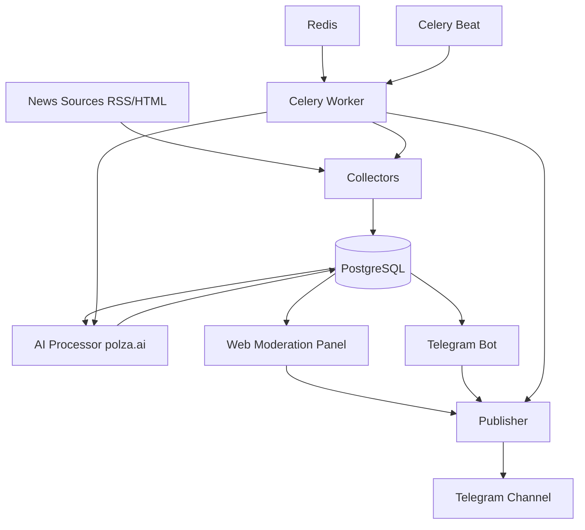
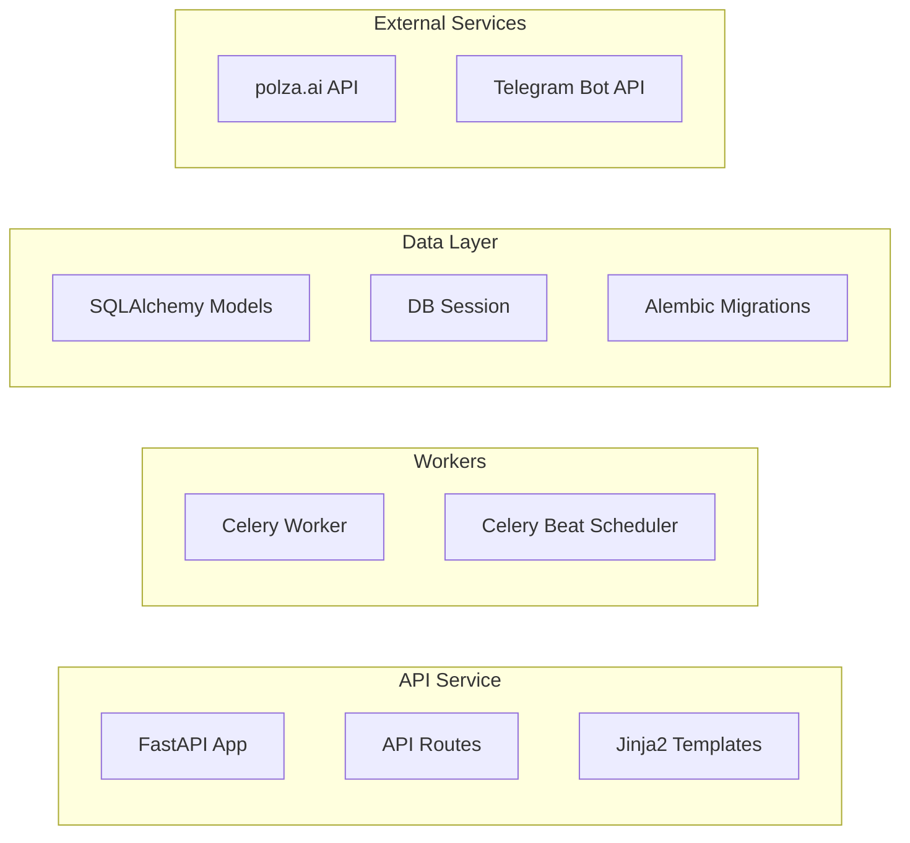
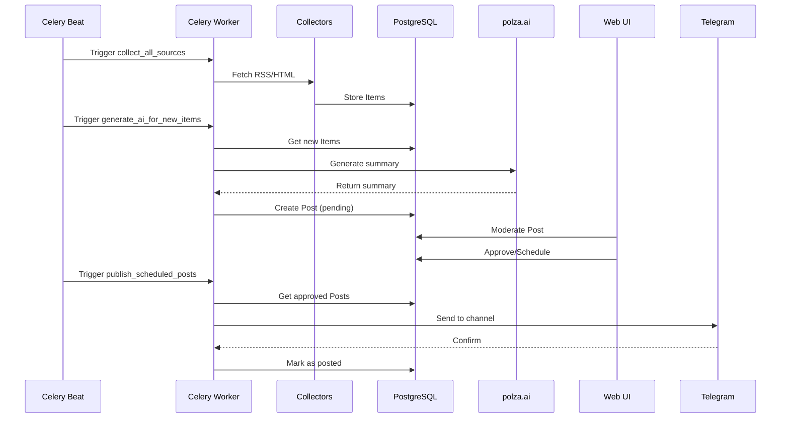
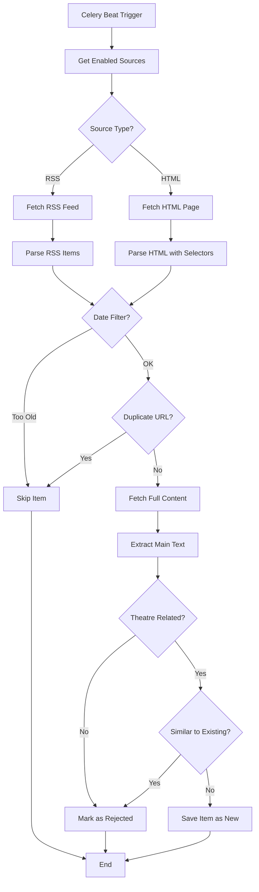
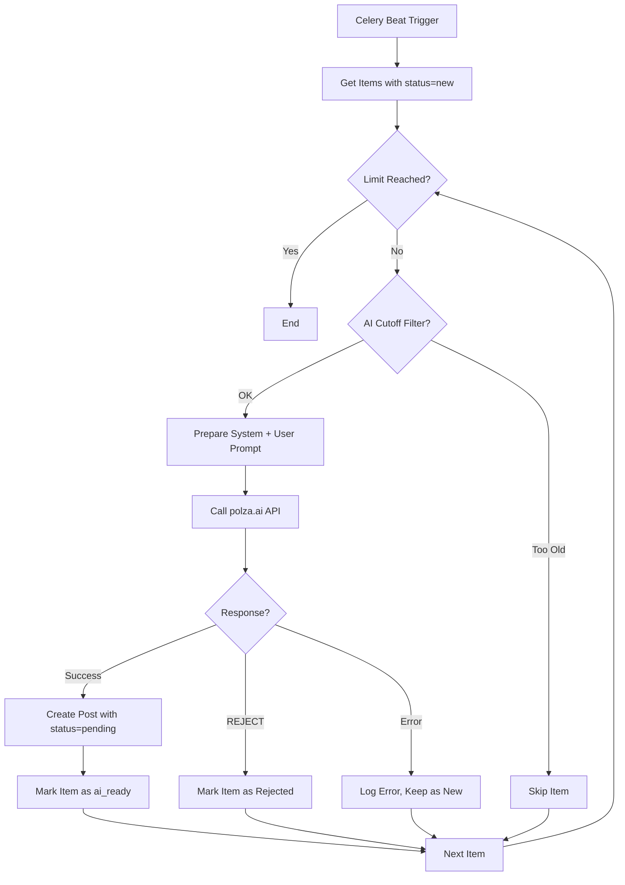
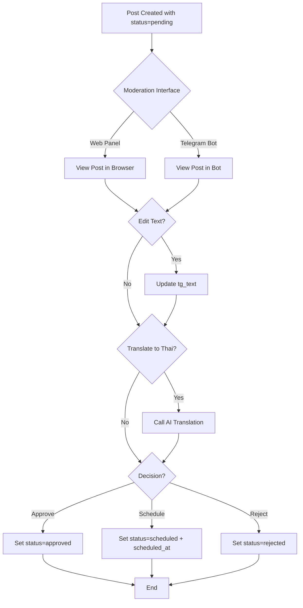
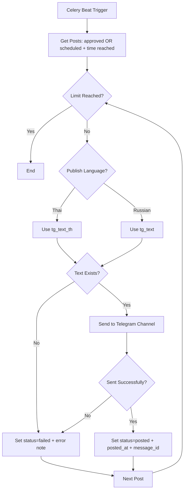

# План инициализации Memory Bank (AGENTS.md)

## Цель
Создать полную документацию проекта в формате AGENTS.md для использования AI-агентами и разработчиками.

## Обзор проекта
**Bakhrushin Museum News** — автоматизированная система для сбора театральных новостей, их обработки с помощью AI и публикации в Telegram-канал @bakhrushinmuseum_news.

### Ключевые технологии
- **Backend**: Python 3.11+, FastAPI, SQLAlchemy, Alembic
- **Database**: PostgreSQL 16
- **Queue/Cache**: Redis 7, Celery
- **AI**: polza.ai (OpenAI-compatible API)
- **Telegram**: aiogram
- **Deployment**: Docker, Docker Compose

## Структура документа AGENTS.md

### 1. Project Overview
- Название и назначение проекта
- Основные возможности
- Целевая аудитория
- Ключевые метрики и KPI

### 2. System Architecture

#### 2.1 High-Level Architecture


#### 2.2 Component Diagram


#### 2.3 Data Flow


### 3. Core Components

#### 3.1 Collectors (`app/collectors/`)
- **RSS Collector** ([`rss.py`](app/collectors/rss.py))
  - Парсинг RSS-лент
  - Извлечение метаданных (title, link, published_at)
  - Фильтрация по дате (NEWS_NOT_BEFORE_DAYS)
  
- **HTML Collector** ([`html.py`](app/collectors/html.py))
  - Парсинг HTML-страниц с помощью BeautifulSoup
  - Конфигурируемые CSS-селекторы
  - Извлечение структурированных данных

#### 3.2 Parsers (`app/parsers/`)
- **Text Extractor** ([`extract.py`](app/parsers/extract.py))
  - Извлечение основного текста из HTML
  - Очистка от рекламы и навигации
  - Нормализация текста

#### 3.3 AI Integration (`app/ai/`)
- **Client** ([`client.py`](app/ai/client.py))
  - OpenAI-compatible клиент для polza.ai
  - Конфигурация модели и параметров
  
- **Prompts** ([`prompts.py`](app/ai/prompts.py))
  - System prompt для генерации постов
  - User prompt template
  - Правила форматирования
  
- **Summarizer** ([`summarize.py`](app/ai/summarize.py))
  - Генерация кратких постов (600-1200 символов)
  - Фильтрация нерелевантных новостей (REJECT)
  - Добавление хэштегов и источника
  
- **Translator** ([`translate.py`](app/ai/translate.py))
  - Перевод с русского на тайский
  - Стили перевода: formal, neutral, social
  - Сохранение форматирования

#### 3.4 Web Interface (`app/api/`)
- **Routes** ([`routes.py`](app/api/routes.py))
  - `/` - список постов на модерации
  - `/posts/{id}` - просмотр и редактирование поста
  - `/sources` - управление источниками
  - API endpoints для CRUD операций
  
- **Templates** ([`app/templates/`](app/templates/))
  - Jinja2 шаблоны для UI
  - Поддержка MSK timezone
  - Inline редактирование

#### 3.5 Telegram Integration (`app/tg/`)
- **Bot** ([`bot.py`](app/tg/bot.py))
  - Команды: /start, /help, /queue
  - Inline-кнопки для модерации
  - Callback handlers для approve/reject/schedule
  - Редактирование через reply
  
- **Sender** ([`sender.py`](app/tg/sender.py))
  - Публикация в канал
  - Поддержка форматирования (HTML/Markdown)
  - Обработка ошибок

#### 3.6 Background Jobs (`app/workers/`)
- **Celery App** ([`celery_app.py`](app/workers/celery_app.py))
  - Конфигурация Celery
  - Подключение к Redis
  - Импорт задач
  
- **Tasks** ([`tasks.py`](app/workers/tasks.py))
  - `collect_all_sources()` - сбор новостей
  - `generate_ai_for_new_items(limit)` - генерация постов
  - `publish_scheduled_posts(limit)` - публикация
  - `health_check_sources()` - проверка доступности источников
  - Расписание (Celery Beat):
    - Сбор: каждые 30 минут
    - AI генерация: каждые 15 минут
    - Публикация: каждые 5 минут
    - Health check: каждые 6 часов

### 4. Data Models

#### 4.1 Database Schema
```mermaid
erDiagram
    Source ||--o{ Item : has
    Item ||--o| Post : generates
    
    Source {
        int id PK
        string name
        enum type "rss|html"
        text url
        boolean enabled
        jsonb parser_config
        int last_status_code
        datetime last_checked_at
        text last_error
        int fail_streak
        datetime created_at
    }
    
    Item {
        int id PK
        int source_id FK
        text url UK
        text title
        datetime published_at
        text raw_text
        text raw_html
        string hash_text
        string lang
        enum status "new|ai_ready|rejected"
        datetime created_at
    }
    
    Post {
        int id PK
        int item_id FK UK
        text tg_text
        text tg_text_th
        jsonb tg_media
        string style_version
        enum moderation_status "pending|approved|rejected|scheduled|posted|failed"
        datetime scheduled_at
        datetime posted_at
        string tg_message_id
        text editor_notes
        datetime created_at
    }
```

#### 4.2 Enums
- **SourceType**: `rss`, `html`
- **ItemStatus**: `new`, `ai_ready`, `rejected`
- **ModerationStatus**: `pending`, `approved`, `rejected`, `scheduled`, `posted`, `failed`

### 5. Configuration

#### 5.1 Environment Variables
```bash
# Database
DATABASE_URL=postgresql://user:pass@db:5432/bakhrushin

# Redis/Celery
REDIS_URL=redis://redis:6379/0
CELERY_BROKER_URL=redis://redis:6379/0
CELERY_RESULT_BACKEND=redis://redis:6379/0

# Telegram
TELEGRAM_BOT_TOKEN=your_bot_token
TELEGRAM_CHANNEL=@bakhrushinmuseum_news
TELEGRAM_ADMIN_IDS=123456789,987654321

# AI (polza.ai)
POLZA_API_KEY=your_api_key
POLZA_BASE_URL=https://api.polza.ai/api/v1
AI_MODEL=openai/gpt-4o-mini
AI_TEMPERATURE=0.4
TG_TRANSLATION_MODEL=openai/gpt-4o-mini
TG_TRANSLATION_STYLE=neutral
TG_PUBLISH_LANGUAGE=th

# Cutoffs (sliding window)
NEWS_NOT_BEFORE_DAYS=7
AI_NOT_BEFORE_DAYS=7

# App
APP_ENV=prod
APP_BASE_URL=http://localhost:8000
SECRET_KEY=change_me

# Auto-disable sources on errors
AUTO_DISABLE_ON_401_403=false
AUTO_DISABLE_THRESHOLD=3
```

#### 5.2 Parser Config Examples
```json
// RSS Source
{
  "type": "rss"
}

// HTML Source
{
  "type": "html",
  "list_selector": "article.news-item",
  "link_selector": "a.title",
  "title_selector": "h2.title",
  "date_selector": "time",
  "date_format": "%Y-%m-%d"
}
```

### 6. Workflows

#### 6.1 News Collection Workflow


#### 6.2 AI Processing Workflow


#### 6.3 Moderation Workflow


#### 6.4 Publishing Workflow


### 7. API Endpoints

#### 7.1 Web UI Routes
| Method | Path | Description |
|--------|------|-------------|
| GET | `/` | Список постов на модерации |
| GET | `/posts/{id}` | Просмотр поста |
| POST | `/posts/{id}/update` | Обновление текста поста |
| POST | `/posts/{id}/translate_th` | Перевод на тайский |
| POST | `/posts/{id}/approve` | Одобрение поста |
| POST | `/posts/{id}/schedule` | Планирование публикации |
| POST | `/posts/{id}/reject` | Отклонение поста |
| GET | `/sources` | Список источников |
| GET | `/sources/{id}/edit` | Редактирование источника |
| POST | `/sources/{id}/update` | Обновление источника |
| POST | `/sources/{id}/test` | Тестирование источника |
| POST | `/sources/{id}/delete` | Удаление источника |
| POST | `/sources/create` | Создание источника |

#### 7.2 Telegram Bot Commands
| Command | Description |
|---------|-------------|
| `/start` | Приветствие и список команд |
| `/help` | Справка по командам |
| `/queue` | Показать первые 10 постов на модерации |

#### 7.3 Telegram Bot Callbacks
| Callback | Description |
|----------|-------------|
| `approve:{post_id}` | Одобрить пост |
| `schedule1h:{post_id}` | Запланировать через 1 час |
| `reject:{post_id}` | Отклонить пост |
| `edit:{post_id}` | Редактировать (reply с новым текстом) |

### 8. AI Integration Details

#### 8.1 polza.ai Configuration
- **Base URL**: `https://api.polza.ai/api/v1`
- **Model**: `openai/gpt-4o-mini` (configurable)
- **Temperature**: 0.4 (balance creativity/consistency)
- **API Compatibility**: OpenAI-compatible

#### 8.2 Prompt Engineering

**System Prompt** ([`prompts.py`](app/ai/prompts.py)):
```
Ты редактор официального Telegram-канала Государственного центрального 
театрального музея имени А. А. Бахрушина.
Твоя задача — писать краткие, аккуратные, культурные посты о новостях 
театрального искусства.

Ограничения и правила:
- НЕ копируй текст первоисточника дословно. Только пересказ.
- 600–1200 знаков (обычно).
- Без кликбейта, без политических оценок.
- В конце обязательно укажи: «Источник: <URL>».
- Добавь 2–5 хэштегов по теме (на русском), например: #театр #премьера #фестиваль.
- Если новость не относится к театру/сценическому искусству — верни строго: REJECT
```

**User Prompt Template**:
```
Заголовок: {title}

Текст новости (извлечённый):
{text}

Ссылка: {url}

Сделай итоговый пост по правилам.
```

#### 8.3 Translation Styles
- **formal**: Официальный стиль для деловых новостей
- **neutral**: Нейтральный стиль (по умолчанию)
- **social**: Социальный стиль для неформальных новостей

#### 8.4 Theatre Keywords Filter
```python
THEATRE_KEYWORDS = [
    "театр", "премьера", "спектакль", "режисс", "актер", "актриса", 
    "сцена", "фестиваль", "драма", "опера", "балет", "постановк", 
    "гастрол", "репертуар", "труппа", "мюзикл", "капустник", 
    "читк", "перформанс", "хореограф"
]
```
Требуется минимум 2 совпадения для прохождения фильтра.

### 9. Deployment

#### 9.1 Docker Services
```yaml
services:
  - db (PostgreSQL 16)
  - redis (Redis 7)
  - api (FastAPI + Uvicorn)
  - celery_worker (Background tasks)
  - celery_beat (Scheduler)
  - tg_bot (Telegram bot)
```

#### 9.2 Deployment Steps
1. Clone repository
2. Copy `.env.example` to `.env`
3. Configure environment variables
4. Run `docker compose up -d --build`
5. Run migrations: `docker compose exec api alembic upgrade head`
6. Seed sources: `docker compose exec api python -m app.scripts.seed_sources`
7. Open web panel: http://localhost:8000

#### 9.3 Health Checks
- Database connectivity
- Redis connectivity
- Source availability (HTTP status codes)
- Celery worker status
- Telegram bot connectivity

### 10. Code Examples

#### 10.1 Adding a New RSS Source
```python
from app.db.session import SessionLocal
from app.db.models import Source, SourceType

with SessionLocal() as db:
    source = Source(
        name="Theatre News",
        type=SourceType.rss,
        url="https://example.com/rss",
        enabled=True,
        parser_config={"type": "rss"}
    )
    db.add(source)
    db.commit()
```

#### 10.2 Adding a New HTML Source
```python
source = Source(
    name="Theatre Portal",
    type=SourceType.html,
    url="https://example.com/news",
    enabled=True,
    parser_config={
        "type": "html",
        "list_selector": "article.news",
        "link_selector": "a.title",
        "title_selector": "h2",
        "date_selector": "time",
        "date_format": "%Y-%m-%d"
    }
)
```

#### 10.3 Manual Task Execution
```bash
# Collect sources
docker compose exec api python -c "from app.workers.tasks import collect_all_sources; collect_all_sources()"

# Generate AI posts
docker compose exec api python -c "from app.workers.tasks import generate_ai_for_new_items; generate_ai_for_new_items(20)"

# Publish posts
docker compose exec api python -c "from app.workers.tasks import publish_scheduled_posts; publish_scheduled_posts(10)"
```

#### 10.4 Database Queries
```python
from sqlalchemy import select
from app.db.session import SessionLocal
from app.db.models import Post, ModerationStatus

# Get pending posts
with SessionLocal() as db:
    posts = db.scalars(
        select(Post)
        .where(Post.moderation_status == ModerationStatus.pending)
        .order_by(Post.created_at.desc())
        .limit(10)
    ).all()
```

### 11. Troubleshooting

#### 11.1 Common Issues

**"Received unregistered task" in celery_worker**
- Причина: Worker не импортировал задачи
- Решение: Перезапустить `docker compose restart celery_worker celery_beat`

**Port 6379 already in use**
- Причина: Конфликт портов Redis
- Решение: Остановить локальный Redis или убрать port mapping в docker-compose.yml

**401/403 errors from sources**
- Причина: Сайт блокирует ботов
- Решение: Отключить источник или использовать другой URL

**AI returns REJECT for theatre news**
- Причина: Недостаточно театральных ключевых слов
- Решение: Проверить текст, настроить THEATRE_KEYWORDS

**Thai translation fails**
- Причина: Пустой tg_text или ошибка API
- Решение: Проверить POLZA_API_KEY, проверить логи

#### 11.2 Logs
```bash
# API logs
docker compose logs -f api

# Worker logs
docker compose logs -f celery_worker

# Beat logs
docker compose logs -f celery_beat

# Bot logs
docker compose logs -f tg_bot

# All logs
docker compose logs -f
```

#### 11.3 Database Backup
```bash
# Dump
docker compose exec db pg_dump -U "$POSTGRES_USER" "$POSTGRES_DB" > backup.sql

# Restore
docker compose exec -T db psql -U "$POSTGRES_USER" "$POSTGRES_DB" < backup.sql
```

### 12. Development Guidelines

#### 12.1 Code Style
- Python 3.11+ features
- Type hints (from `__future__ import annotations`)
- SQLAlchemy 2.0 style
- Async where appropriate (aiogram, httpx)

#### 12.2 Database Migrations
```bash
# Create migration
docker compose exec api alembic revision --autogenerate -m "description"

# Apply migrations
docker compose exec api alembic upgrade head

# Rollback
docker compose exec api alembic downgrade -1
```

#### 12.3 Testing Sources
```bash
# Test single source via web UI
# Navigate to /sources, click "Test" button

# Test via Python
docker compose exec api python -c "
from app.collectors.rss import fetch_rss
items = fetch_rss('https://example.com/rss', {})
print(f'Found {len(items)} items')
"
```

#### 12.4 Adding New Features

**New Collector Type**:
1. Create `app/collectors/new_type.py`
2. Implement `fetch_*()` function
3. Add to `SourceType` enum
4. Update `collect_all_sources()` task

**New AI Model**:
1. Update `AI_MODEL` in `.env`
2. Test with sample items
3. Adjust temperature if needed

**New Moderation Status**:
1. Add to `ModerationStatus` enum
2. Create migration
3. Update UI templates
4. Update publisher logic

### 13. Performance Considerations

#### 13.1 Database Indexes
- `items.url` (unique constraint)
- `items.hash_text` (similarity checks)
- `posts.moderation_status` (filtering)
- `posts.scheduled_at` (publishing)

#### 13.2 Celery Optimization
- Task limits to prevent overload
- Retry policies for transient errors
- Result expiration
- Task routing (if needed)

#### 13.3 AI Rate Limits
- Batch processing with limits
- Exponential backoff on errors
- Token usage monitoring

### 14. Security

#### 14.1 Secrets Management
- All secrets in `.env` (not committed)
- `.env.example` as template
- Docker secrets for production

#### 14.2 Access Control
- Telegram admin IDs whitelist
- No public API endpoints
- Database credentials rotation

#### 14.3 Input Validation
- URL validation for sources
- HTML sanitization
- SQL injection prevention (SQLAlchemy)

### 15. Monitoring

#### 15.1 Metrics to Track
- Items collected per hour
- AI processing success rate
- Posts published per day
- Source health status
- Error rates

#### 15.2 Alerts
- Source failures (3+ consecutive)
- AI API errors
- Telegram publishing failures
- Database connection issues

### 16. Future Enhancements

#### 16.1 Planned Features
- [ ] Multi-language support (beyond RU/TH)
- [ ] Image extraction and processing
- [ ] Advanced duplicate detection (embeddings)
- [ ] Analytics dashboard
- [ ] A/B testing for prompts
- [ ] Webhook notifications
- [ ] RSS feed for published posts

#### 16.2 Technical Debt
- [ ] Add comprehensive tests
- [ ] Improve error handling
- [ ] Add request rate limiting
- [ ] Implement caching layer
- [ ] Add monitoring/observability

---

## Следующие шаги

После согласования этого плана будет создан файл `AGENTS.md` в корне проекта со всей указанной информацией, структурированной для использования AI-агентами и разработчиками.

Документ будет включать:
- Полное описание архитектуры с диаграммами
- Детальную документацию всех компонентов
- Примеры кода и конфигураций
- Workflow-диаграммы для всех процессов
- Руководства по развертыванию и troubleshooting
- Best practices для разработки

Вы согласны с этим планом или хотите внести изменения?
